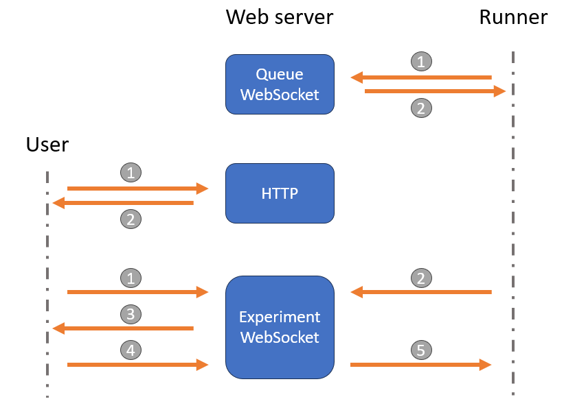

High-level overview
=====

SHARPIE is organized around two main components: the web server and the runner.

Web server
----------------

The web server is serving files to the user as well as interacting with the backend runner. Here, we will only highlight the fonctionnalities but we invite you to have a look at the Django documentation for a better understanding of how it is working. The web server is divided in 4 apps:

* **Home**: the landing page of the platform.
* **Admin**: managing the platform settings, users, and experiments.
* **Accounts**: login in and registering users.
* **Experiments**: participant-facing and backend-facing interface to run experiments.

Runner
----------------

The runner is responsible for managing the execution of experiments. The runner communicates with the web server to provide real-time updates and receive participant inputs. It is designed to be modular and extensible, allowing researchers to easily integrate new environments and algorithms by using simple wrappers. It is divided in several modules:

* **Manager**: intitializing and running environments and AI agents.
* **Environment (per experiment)**: environment wrapper, input mapping and termination condition.
* **Agent (per experiment)**: agent(s) wrapper.

Interaction diagram
----------------

The following diagram illustrates the interaction between the web server, runner and participant during an experiment.

There are 3 main types of interactions:

1. **Runner - Web server**: once the runner is started, it connects to the Queue WebSocket of the web server and regularly asks if a new experiment is witing in the queue. When an experiment is available, the web server sends its configuration to the runner, and the runner disconnects from the Queue WebSocket and connects to the Experiment WebSocket.
2. **User - Web server**: all users interact with SHARPIE throught their web browser using HTTP(s) requests to the web server. Once a participant starts an experiment, the web server sends them the experiment interface and connects them to the Experiment WebSocket. The participant will then wait for the runner to send the first observation.
3. **User - Web server - Runner**: 
    During the experiment, the participant interacts with the web interface, which sends their actions to the web server using the Experiment WebSocket. The web server forwards these actions to the runner, which processes them in the environment and sends back the new observations, rewards, and done flags. In summary, the communication is as follows:
    
    1. Participant connects to the Experiment WebSocket.
    2. Runner connects to the Experiment WebSocket, prepare the environment, AI agents and sends the rendered observation.
    3. Web server forwards the observation to the participant and logs the interaction in the database.
    4. Participant sends an action through the Experiment WebSocket.
    5. Web server forwards the action to the runner which processes it in the environment and sends back the new observation, reward, etc.
    
    Steps 3 to 5 are repeated until the episode is over. The user and runner then disconnect from the Experiment WebSocket, and the runner goes back to the Queue WebSocket.